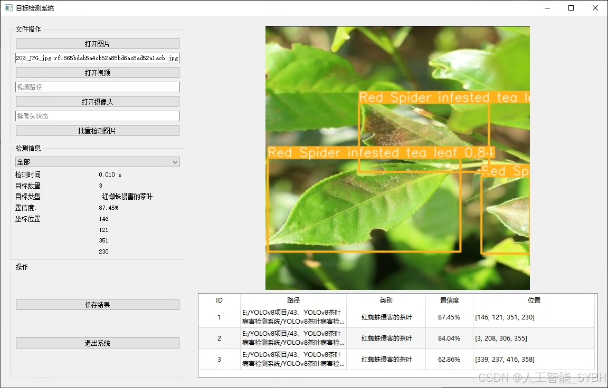
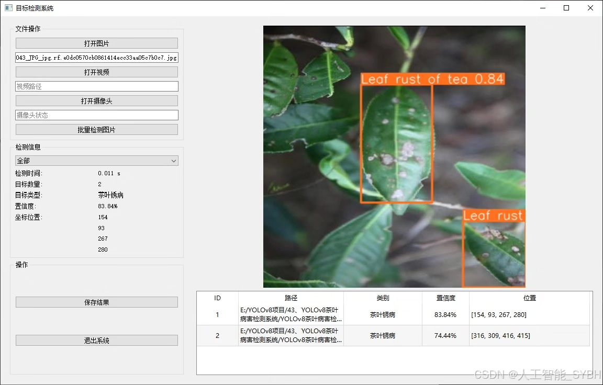
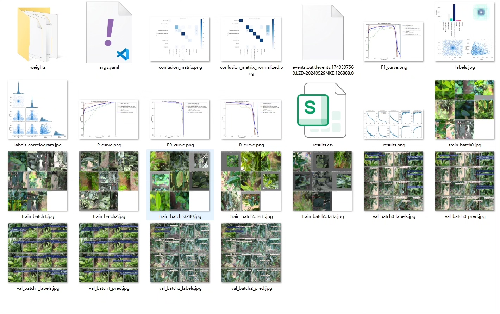
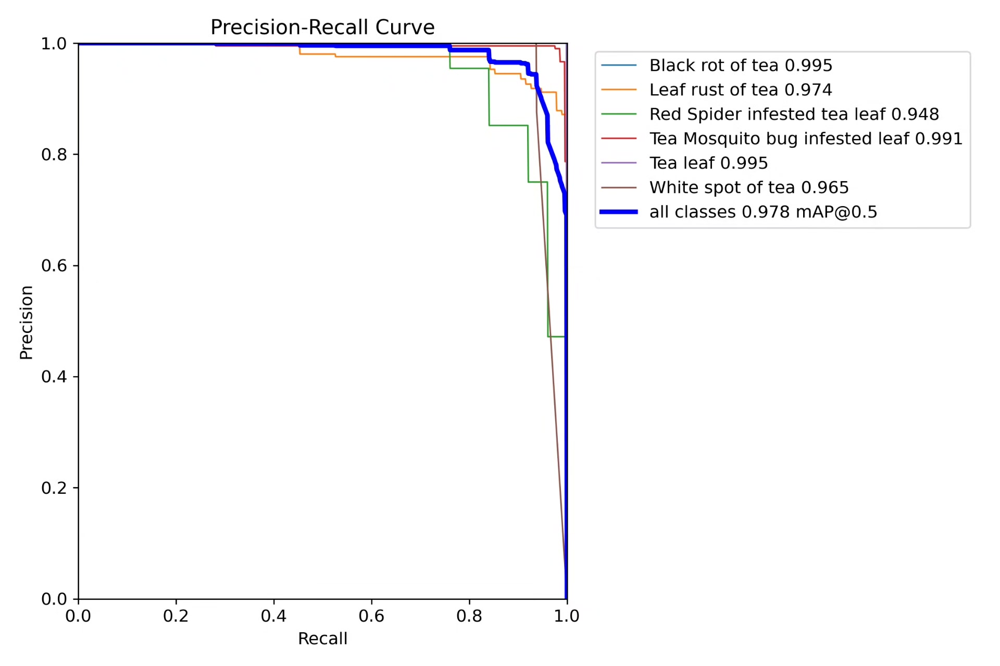
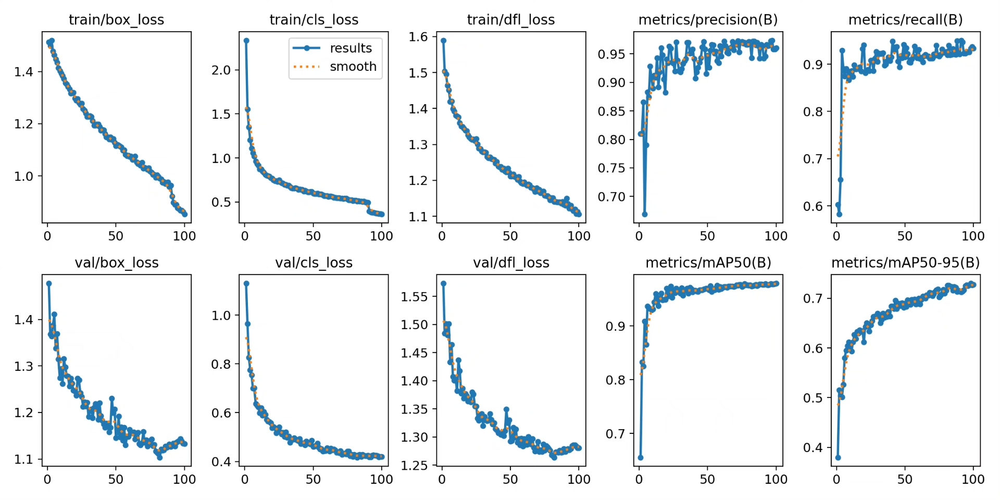
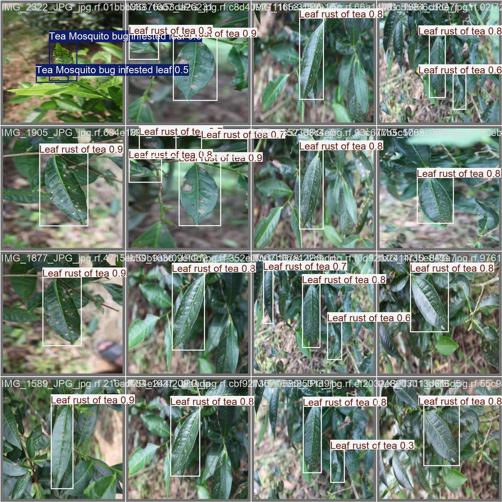
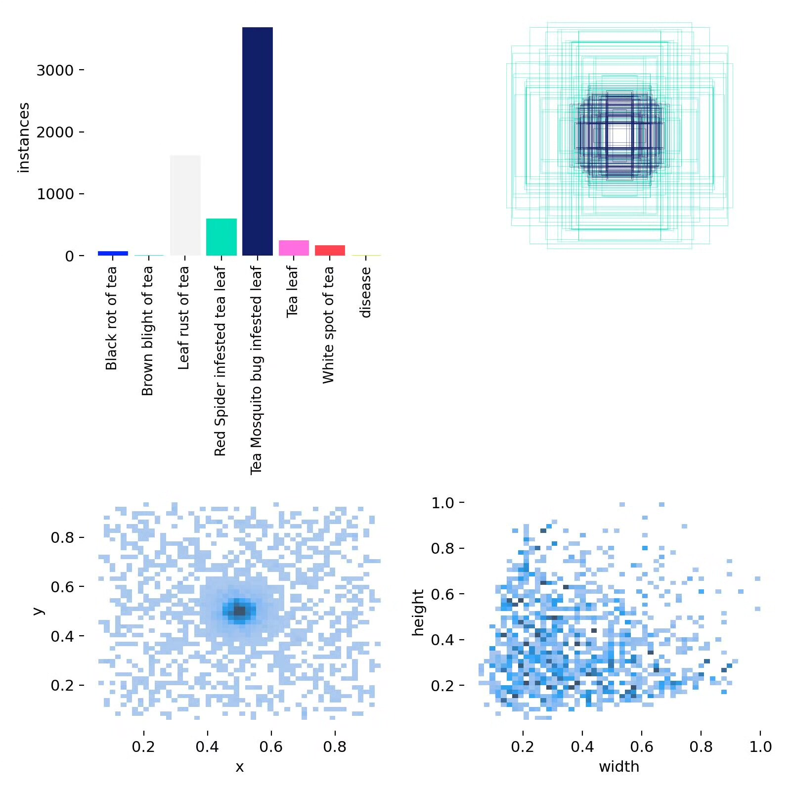
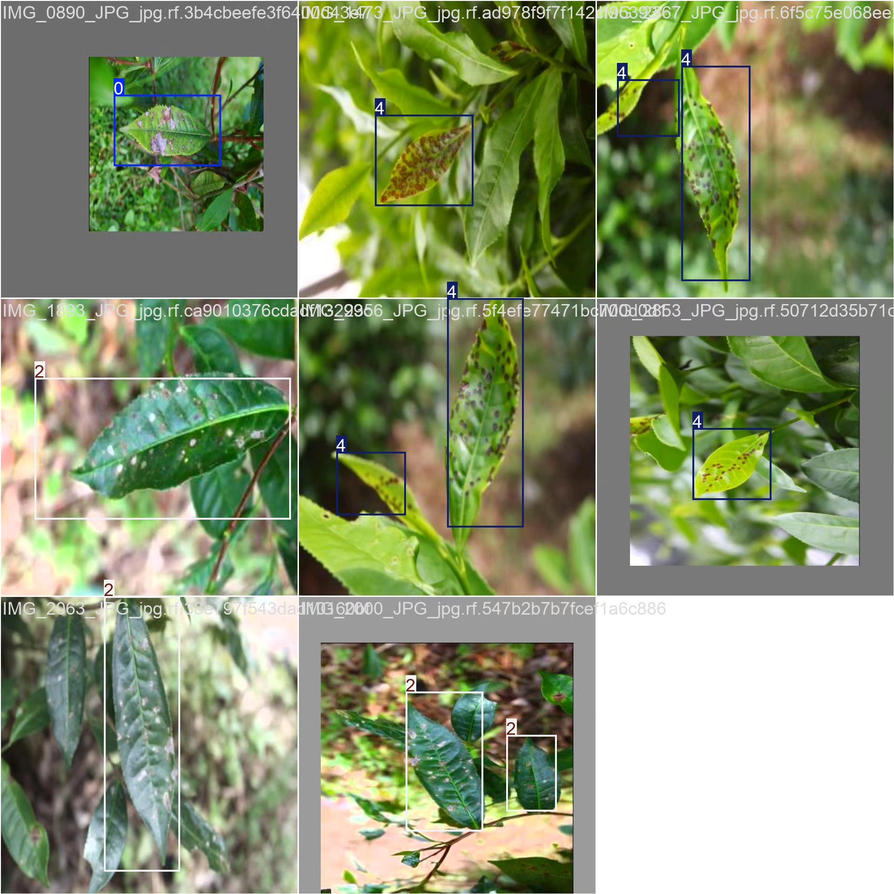

# Tea Disease Detection System Based on YOLOv8 Deep Learning (YOLOv8+Y)

## Body

This project is based on the advanced YOLOv8 deep learning algorithm to develop a high-precision and efficient tea disease detection system. The system can accurately identify and classify eight common tea diseases and pests, including: Black rot of tea (Tea black rot), Brown blight of tea (Brown blight of tea), Leaf rust of tea (Leaf rust of tea), Red spider infested leaf (Red Spider infested tea leaf), Tea mosquito bug infested leaf (Tea Mosquito bug infested leaf), Healthy tea leaf (Tea leaf), White spot of tea (White spot of tea) and other diseases (disease). The project uses a professional constructed tea disease dataset for training and validation, with a training set of 4736 images, a validation set of 273 images, and a test set of 406 images, ensuring that the model has excellent generalization ability under different lighting conditions, shooting angles, and disease severity.

The company's products have been granted the YOLO official commercial license certification.

We provide after-sales service.

After payment, we will provide WeChat IDs for instant questions.

Environmental configuration: We will provide an environmental configuration tutorial, and WeChat will provide answers.

Remote installation service: If you need remote configuration, an additional fee of 69 is required,
If the configuration fails, all fees will be refunded (specially for old computers only refund installation fees)

Retraining dataset: After configuring the environment, you can train on your own computer.
If you need us to retrain, just pay 69 + computing power fees (2.5 yuan/hour)

Full after-sales service

## Images

## Payment

Here is a pay link on Stripe ( https://buy.stripe.com/3cs8yP7sY87d0vu9AB ). Please contact me lonlonago@foxmail.com after funding $89, and I will send you a complete data files , thank you!

